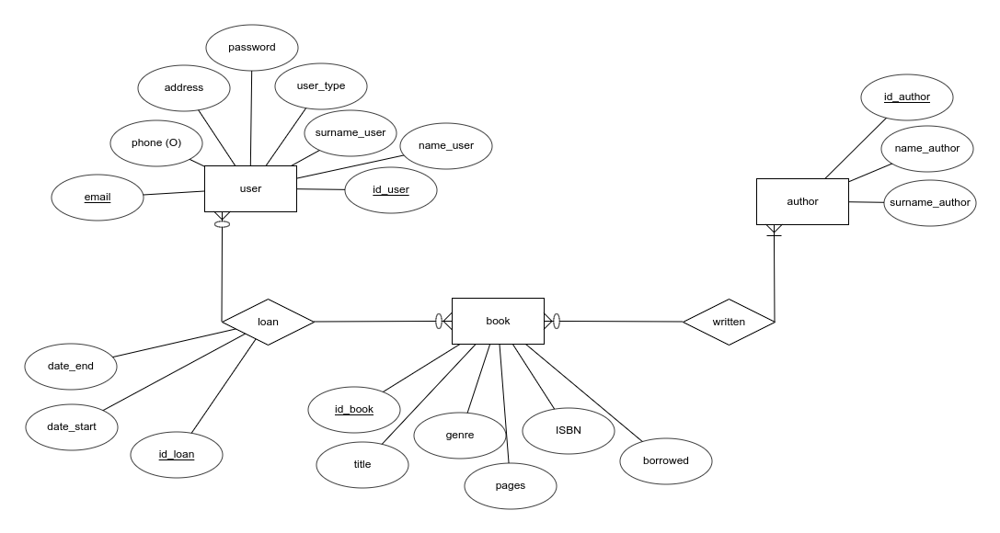

# Librarian

## DESCRIPTION

Librarian is an application designed to manage loans, books and users from libraries. Librarian will allow librarians to be more productive handling normal tasks from the library, avoiding the usage of pen and paper to keep the track of the loans and books from the library. 

Librarian can manage the books and loans from the library and students can search books from the web whitout moving to the library to see if they have the book. Students can also check when they have to return the books in order to not get punished.
Librarian will make your life easier because you can see if the books is in the library and where is placed. 

**Admins** can:

<ul>
<li>Manage accounts, books, authors, loans.</li>
</ul>

**Librarians** can:

<ul>
    <li>Manage all the books, authors and loans.</li>
    <li>Contact with the admin.</li>
</ul>

**Students** can:

<ul>
    <li>Search for books and authors.</li>
    <li>Look for the books they have borrowed.</li>
    <li>They can borrow a maximum of 5 books.</li>
</ul>

## Tables

<ul>
    <li>User –> admin(1), librarian(10) or student(20)</li>
    <li>Book</li>
    <li>Author</li>
    <li>Loan</li>
    <li>Written</li>
</ul>

**Admin** permission account:

<ul>
    <li>Email: bilbobolson@librarian.com</li>
    <li>Password: 1234</li>
</ul>

Link to the <a href="https://luque-librarian.000webhostapp.com/">page</a>
